# Eater Restaurant Map

**Every restaurant from Eater's London map guides on one map — installable, searchable, and fully usable offline.**

Eater publishes hundreds of excellent London restaurant guides, but each one is a separate article with its own small map. This project scrapes all of them, merges duplicate entries into one record per real restaurant, and serves the result as an offline-first Progressive Web App: **2,336 restaurants from 296 guides**, rendered over a self-hosted vector basemap with London's full rail network in official line colours. Install it on your phone and the entire map — tiles included — keeps working on the Tube.

**Live app:** [eater.chrisj.uk](https://eater.chrisj.uk)

<!-- screenshot: desktop map over central London showing the translucent marker field, opaque priced markers, colour-coded rail overlay, and the sidebar list -->

## Features

- **Works completely offline.** A service worker precaches the app, the restaurant data, and a bundled Great Britain vector basemap (~76 MB of PMTiles, fonts, and sprites) with a byte-level progress bar. PMTiles are read via HTTP Range requests, which the Cache API can't serve natively — the service worker slices ranges out of the cached archives itself.
- **One record per restaurant.** A precision-first dedupe pass merges 4,043 raw guide entries into 2,336 restaurants: normalised names, geographic clustering with a 200 m threshold calibrated against real geocoding splits vs. real chain branches, postcode-based union-find, and a token-subset recall pass. Details show every source guide and every distinct description; 665 restaurants carry write-ups from more than one guide.
- **London rail overlay.** The complete network — Tube, Overground, DLR, Elizabeth line, trams, cable car, and National Rail — built from OpenStreetMap and colour-coded by official TfL line and operator brand colours, with stations and a "which lines are these?" popup on hover or tap. Always visible, even at zooms where standard basemaps drop rail entirely.
- **Canvas marker rendering.** All markers draw on a single canvas overlay, composited at a flat opacity so dense areas never darken into blobs; the Eater 38 priced picks stay opaque on top. Stacked markers fan out into an even ring of thumb-sized targets ("spiderfy") that is zoom-aware and prunes itself as markers separate.
- **Search and navigate.** Full-text search across names, addresses, descriptions, and guide titles; place/address geocoding via Nominatim; price-tier filter; an in-view list sorted by price tier and distance from Charing Cross; Google Maps and Citymapper directions (with an Android app intent and Play Store fallback).
- **Shareable deep links.** `?r=<id>` selects a restaurant and `#zoom/lat/lon` restores the camera — written with `replaceState`, so links are shareable and work offline without polluting history; the Share button in the details panel copies them for you.
- **Installable PWA** with Android install prompt, iOS instructions, and persistent-storage requests so the browser keeps the offline cache.

## How it works

```mermaid
flowchart LR
  subgraph pipeline [Data pipeline - Python]
    A[audit_eater_sitemaps.py<br/>enumerate guide URLs] --> B[download_eater_urls_in_batches.py<br/>polite, resumable downloader]
    B --> C[scrape_eater_maps_to_db.py<br/>NEXT_DATA + JSON-LD to SQLite]
    C --> D[build-public-data.py<br/>compact public JSON]
  end
  D --> E[(private repo<br/>eater-map-data)]
  subgraph build [Build - Node]
    E -->|fetch-data.mjs + read-only PAT| F[dedupe.mjs<br/>merge entries per restaurant]
    F --> G[vite build<br/>static site]
  end
  subgraph app [Browser - SvelteKit PWA]
    G --> H[Service worker<br/>precache + PMTiles Range slicing]
    H --> I[MapLibre GL<br/>online: Protomaps API<br/>offline: bundled GB PMTiles]
  end
```



- **Scraping** is deliberately polite: robots.txt checks, one request at a time, per-host delays with jitter, `Retry-After` support, exponential backoff, and a resumable SQLite manifest. Pages are parsed from Next.js `__NEXT_DATA__`, JSON-LD, and rendered map cards into an auditable database with per-entry validation flags.
- **The scraped data itself is not in this repo.** It lives in a private repo (`eater-map-data`) and is fetched at build time with a fine-grained read-only GitHub token, so the public repo contains code only.
- **Offline basemap** tiles are extracted from Protomaps daily builds: high-detail tiles only where restaurants actually are (a buffered grid region, z≤14 — capped so the file stays under GitHub's 100 MB limit) plus coarse whole-of-Great-Britain context tiles (z≤9). Online, the app switches live to the global Protomaps API and roams anywhere.
- **The rail overlay** is generated by `build-tube.mjs` from Overpass API queries. OSM's own colour tags are unreliable, so TfL lines are matched by line name and National Rail by operator brand; each physical track is drawn once per line so the translucent rendering stays uniform.

The frontend is a static SvelteKit SPA (Svelte 5 runes, `ssr=false`) with a single `AppState` class as the source of truth. `docs/ARCHITECTURE.md` documents the module layout and the hand-tuned rendering/interaction invariants.

## Running it locally

Requires Node.js (pnpm 11 via corepack) — and a restaurant dataset. The build fetches the dataset from a private repo, so a fully fresh build needs a `DATA_REPO_TOKEN`; without one you can still run everything against your own data file in the same shape (see `scripts/dedupe.mjs` for the expected fields).

```sh
pnpm install
pnpm dev            # dev server on http://127.0.0.1:5173
pnpm test           # vitest unit tests (pure modules: data, links, geocode, URL state, markers)
pnpm build          # fetch data -> dedupe -> static build into build/
pnpm preview        # serve the production build on http://127.0.0.1:4173
                    # (the service worker — and offline mode — run only here, not in dev)
```

On Windows, `deploy-local.bat` does install + build + serve + open-browser in one double-click.

Configuration (`.env.example`):

| Variable | Purpose |
|---|---|
| `VITE_PROTOMAPS_KEY` | Protomaps API key for online global tiles (CORS/domain-restricted). Without it the app still works in offline mode with the bundled GB tiles. |
| `DATA_REPO_TOKEN` | Fine-grained read-only GitHub PAT used by `scripts/fetch-data.mjs` to pull the private dataset at build time. Not needed if `static/data/restaurants.raw.json` is already present. |

Asset regeneration scripts (each needs internet once; outputs are committed):

```sh
pnpm build:basemap   # extract offline PMTiles from Protomaps daily builds + fonts/sprites
                     # (tunable: DETAIL_MAXZOOM, default 14; GB_MAXZOOM, default 9)
pnpm build:tube      # rebuild the rail-network GeoJSON from OpenStreetMap Overpass
pnpm export:data     # rebuild the public dataset from the scrape database (Python)
pnpm dedupe:data     # re-run the restaurant dedupe (dry-run without --write)
```

## Project structure

```
data-pipeline/            Python scrapers (sitemap audit, batch downloader, HTML->SQLite)
  scripts/                Basemap, rail-network, and public-data build scripts
scripts/                  Build-time data fetch + dedupe (run by pnpm build)
src/
  lib/constants.js        Every tuned constant in one place
  lib/state.svelte.js     AppState (Svelte 5 runes)
  lib/map/                MapLibre styles, canvas marker renderer + spiderfy, map lifecycle
  lib/ui/                 Search, filters, sidebar/details, popups, install flow
  service-worker.js       Offline precache with progress + PMTiles Range slicing
static/basemap/           Bundled offline vector tiles, fonts, sprites
static/tube-lines.geojson Colour-coded rail network (generated)
docs/ARCHITECTURE.md      Module map + rendering/interaction invariants
DEPLOYMENT.md             Vercel, domains, basemap and data build notes
```

## Tech stack

SvelteKit 2 / Svelte 5 (runes) · Vite 8 · MapLibre GL JS 5 · PMTiles 4 · Protomaps basemaps · Vitest · Python 3 (scraping/ETL, SQLite) · pnpm · Vercel

## Status

Personal project, built June–July 2026 and deployed continuously to [eater.chrisj.uk](https://eater.chrisj.uk). The in-app roadmap lists planned improvements: removing closed restaurants, opening times, ratings, cuisine categories, and coverage beyond London.

**Limitations:** data reflects Eater guides at scrape time (some restaurants may have closed); price tiers exist only for the 38 entries Eater prices; the curated dataset is private, so external contributors can build the app but not reproduce the exact deployed data without their own scrape.

Map data © [OpenStreetMap](https://www.openstreetmap.org/copyright) contributors, tiles by [Protomaps](https://protomaps.com). Restaurant editorial content belongs to Eater; this is an unaffiliated personal project.
